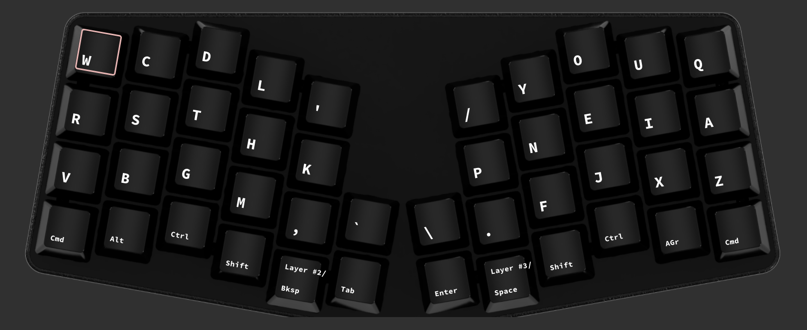
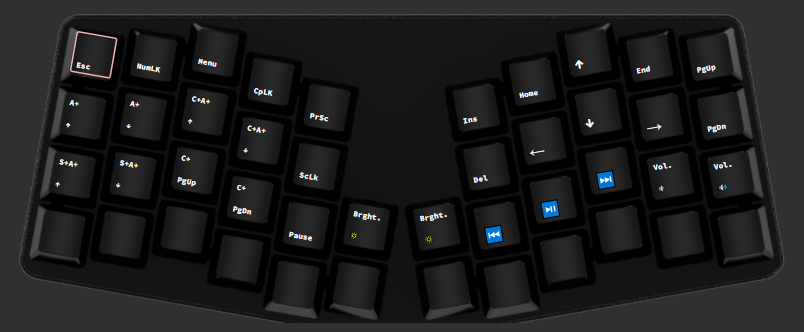
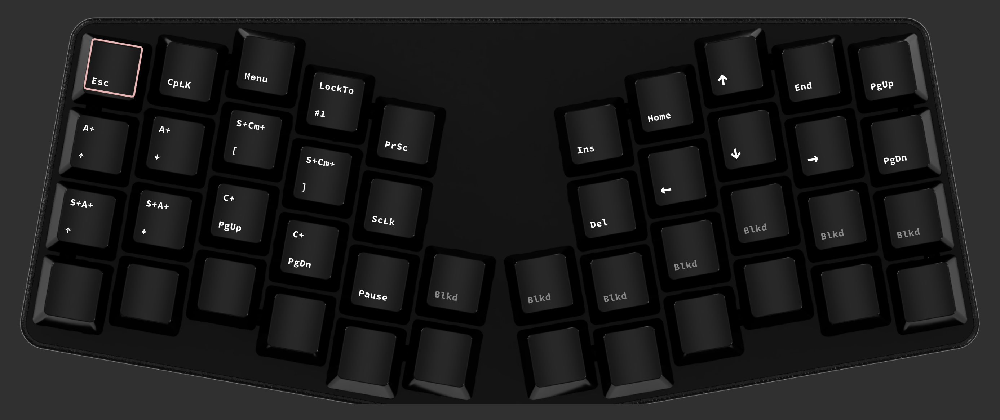
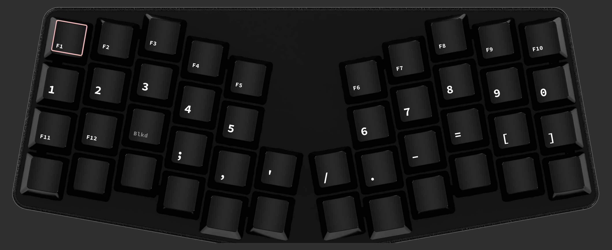

# Atreus Keymap

Since I use an Atreus keyboard, I have a custom setup for the rest of my keymap that works in conjunction with the layout.

The JSON config file for the Keyboard.io graphical configurator [Chrysalis](https://github.com/keyboardio/Chrysalis) is included [here](APT.json).

**Note**: Only the symmetric configuration is provided.

## Base Layers

The first layer is the APT layout, with some additional punctuation on the extra middle keys.

Mods are symmetric in the bottom corners, and extra layers are mod taps on the thumb home keys.

---

The second layer has the same general map but a QWERTY layout, with accompanying punctuation changes.

---

Next is the navigation and shortcut layer, and is also where `Escape`, `Caps Lock`, `Menu`, `Print Screen`, `Scroll Lock`, `Pause`, and a key that switches the default layer between APT and QWERTY. The whole bottom row is passthrough.

---

Last is the number and symbol layer. Function keys are setup here as well, along with the remaining symbol keys. Again the bottom row is passthrough.

