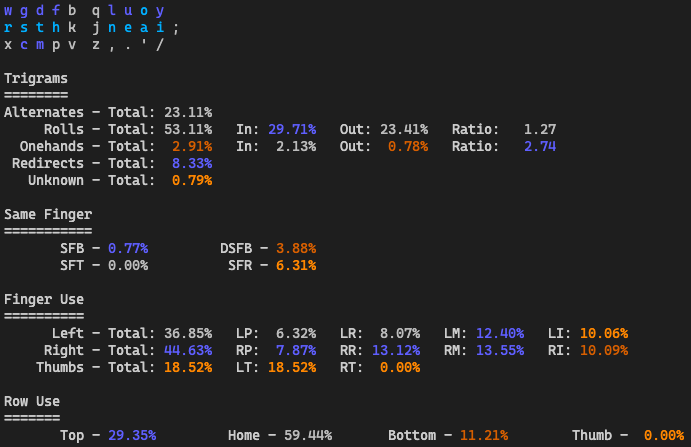

# APTv3 Layout

This is an alternate keyboard layout initially based on the work done in [MTGAP][1] and [CTGAP][2].

```txt
w c d f b  q l u o y
r s t h k  j n e a i ;
x g m p v  z , . ' /
```

## Angle Mod

On traditional row-stagger keyboards, the bottom row keys on the left side can be difficult to press with the same fingers used for the home/top row in the same columns. One workaround popularized for the Colemak layouts is known as an Angle Mod.

This mod rotates the first 5 letters in the bottom row left by 1 spot, and the leftmost letter is wrapped around to the 5th spot (QWERTY `b` spot). In conjunction with the letter shifts, the intention is that you will also change the fingers you use, so the SFB/column relationships are maintained.

This is what that looks like on APTv3:

```txt
w c d f b q l u o y
 r s t h k j n e a i ;
  g m p v x z , . ' /
```

In this case, `g` is pressed with Ring, `m` with Middle, and `pvx` are all with Index.

## Genkey

[Semilin's Genkey analyzer](https://github.com/semilin/genkey) heatmap and stat breakdown, using top 500 trigrams for analysis.


```txt
Rolls (l): 20.61%
        Inward: ~17.31%
        Outward: ~3.31%
Rolls (r): 29.81%
        Inward: ~21.68%
        Outward: ~8.12%
Inward Rolls: ~38.99%
Outward Rolls: ~11.43%
Total Rolls: ~50.42%
Alternates: ~34.07%
Onehands: ~3.53%
Redirects: ~5.69%
Finger Speed (weighted): [1.15 1.59 1.52 1.20 1.58 1.62 1.57 0.90 0.00 0.00]
Finger Speed (unweighted): [1.73 5.74 7.30 6.58 8.70 7.76 5.65 1.36 0.00 0.00]
Highest Speed (weighted): 1.62 (RM)
Highest Speed (unweighted): 8.70 (RI)
Index Usage: 12.2% 12.3%
SFBs: 0.949%
DSFBs: 6.043%
LSBs: 0.40%
```

## a200

[ClemenPine's 200 analyzer](https://github.com/ClemenPine/200-analyzer) heatmap and stat breakdown, using MonkeyType quotes corpus.



[1]: https://mathematicalmulticore.wordpress.com/the-keyboard-layout-project/
[2]: https://github.com/CTGAP/ctgap-keyboard-layout#ctgap-20-deprecated
