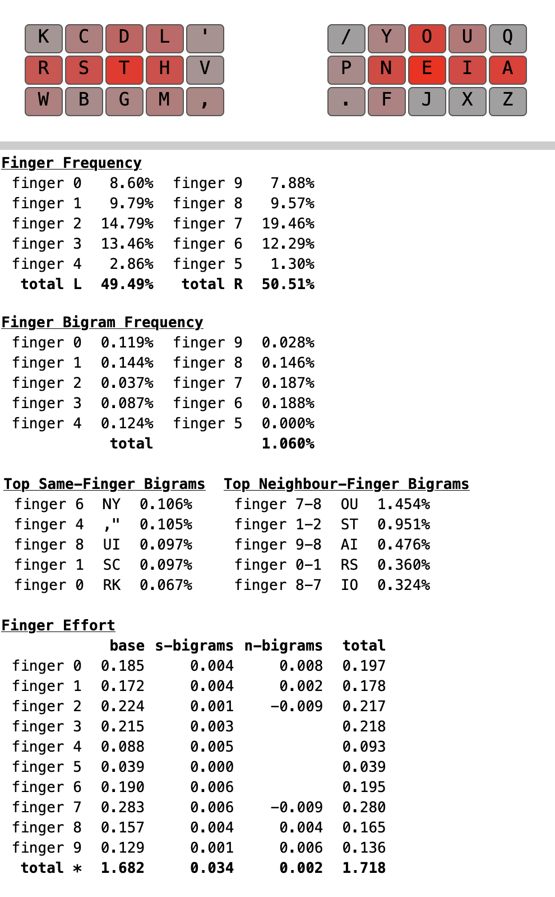
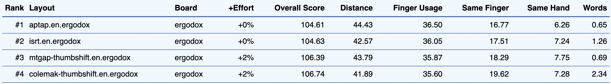

# APT Layout

This is an alternate keyboard layout initially based on the work done in [MTGAP][1] and [CTGAP][2] [[notes](#notes)].

```txt
w c d l k j y o u /
r s t h v p n e i a
q b g m x z f ' , .
```

## Analysis

### ModDH

[SteveP's ModDH Analyzer](https://colemakmods.github.io/mod-dh/analyze.html) in Matrix mode.


### KLA

[KLA Analyzer](https://klanext.keyboard-design.com) using the Alice in Wonderland corpus and the KLA JSON included in this repo.


[1]: https://mathematicalmulticore.wordpress.com/the-keyboard-layout-project/
[2]: https://github.com/CTGAP/ctgap-keyboard-layout

---

## Notes

The CTGAP repo was taken offline. Layout for posterity is as follows:
```txt
w c l d k  j y o u /
r s t h m  p n e i a
z v g f b  q x ' , .
```
