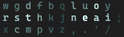

# APT Layout

This is an alternate keyboard layout initially based on the work done in [MTGAP][1] and [CTGAP][2].

```txt
x c d k q  j p u o ,
r s t l m  y n e a i
w g b h v  z f ' ; .
```

My [Keyboard.io Atreus](https://keyboard.io/atreus) configs are in the [Atreus](Atreus) directory.


## Genkey

[Semilin's Genkey analyzer](https://github.com/semilin/genkey) heatmap and stat breakdown, using top 500 trigrams for analysis.



```txt
Rolls (l): 20.08%
        Inward: ~17.15%
        Outward: ~2.93%
Rolls (r): 29.26%
        Inward: ~20.96%
        Outward: ~8.29%
Alternates: ~37.75%
Onehands: ~2.01%
Redirects: ~4.70%
Finger Speed (weighted): [1.26 1.82 1.05 2.07 1.73 1.43 1.19 1.18]
Finger Speed (unweighted): [1.89 6.53 5.06 11.41 9.54 6.88 4.28 1.76]
Highest Speed (weighted): 2.07 (LI)
Highest Speed (unweighted): 11.41 (LI)
Index Usage: 13.1% 13.2%
SFBs: 0.837%
DSFBs: 6.157%
LSBs: 0.54%
```

[1]: https://mathematicalmulticore.wordpress.com/the-keyboard-layout-project/
[2]: https://github.com/CTGAP/ctgap-keyboard-layout#ctgap-20-deprecated
